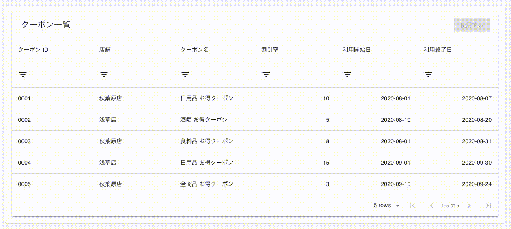

# Title

## 問題となる現象

行を選択する際に、state が更新されて再描画が走ることで、フィルターがリセットされてしまう


## 問題解決後

列の設定情報自体を state 化することで、上記の現象が発生しなくなる([commit](https://github.com/iam326/material-table-re-rendering-resets-the-filter/commit/4c86c53e04c150454fe34c9343f2b800261b3d3c))



## Usage

```
$ yarn install
$ yarn start
```

## Reference

* [material-table - Filtering states reset upon rerendering remote table](https://github.com/mbrn/material-table/issues/491)
